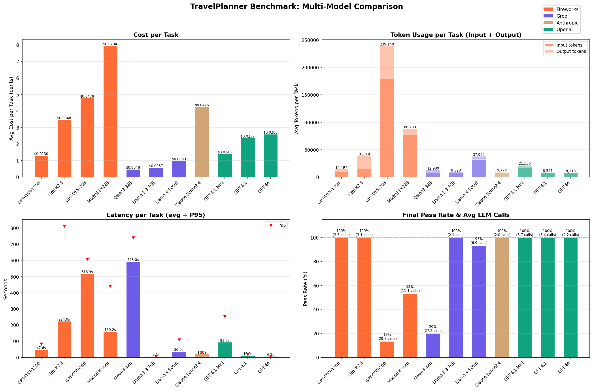
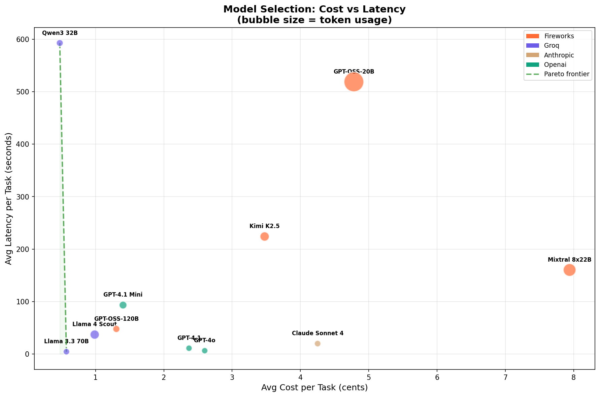
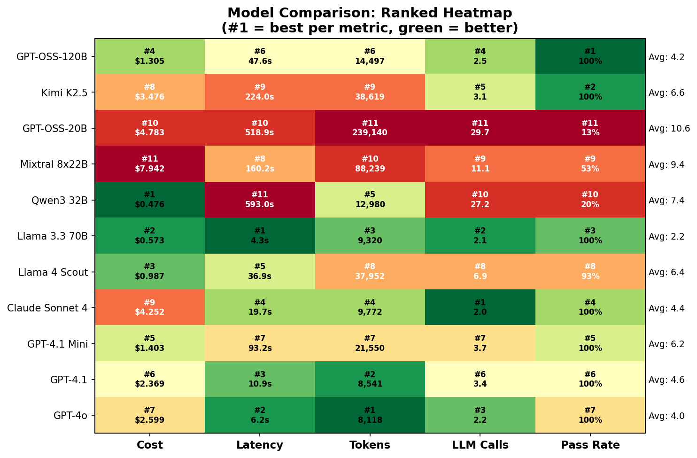

# Model Landscape: Which LLMs Work for Multi-Constraint Planning?

We ran 11 models across 4 providers on the hardest TravelPlanner tasks. No code changes, no prompt tweaks, no per-model tuning. Swap the model name in the config and run.

## Results

```
                     Pass Rate    Cost/Task    Latency    LLM Calls
                     ─────────    ─────────    ───────    ─────────
  Llama 3.3 70B        100%       $0.006       4.3s        2.1
  GPT-OSS-120B         100%       $0.013      47.6s        2.5
  GPT-4.1 Mini         100%       $0.014      93.2s        3.7
  GPT-4.1              100%       $0.024      10.9s        3.4
  GPT-4o               100%       $0.026       6.2s        2.2
  Kimi K2.5            100%       $0.035     224.0s        3.1
  Claude Sonnet 4      100%       $0.043      19.7s        2.0
  ──────────────────────────────────────────────────────────────
  Llama 4 Scout       93.3%       $0.003       7.3s        2.1
  Mixtral 8x22B       53.3%       $0.014     160.3s        7.8
  Qwen3 32B           20.0%       $0.009     593.0s       27.2
  GPT-OSS-20B         13.3%       $0.011     519.0s       29.7
```

Seven models pass everything. Four don't. The line between them is sharper than you'd expect.

---

## At a Glance

### Cost, Tokens, Latency, and Pass Rate



### Cost vs Latency (Pareto Frontier)



### Ranked Heatmap



---

## It's Not About Code Generation

The models that fail here are not bad at code generation.

OpenSymbolicAI's [calculator benchmark](https://github.com/OpenSymbolicAI/core-py) runs Qwen3 1.7B, a model 40x smaller than anything tested here, and it hits 100% on 120 math tasks. It reads the primitives, writes correct Python, and solves the problem in one shot. Gemma3 4B gets 94%. Qwen3 8B gets 100%.

Small models generate code fine when the task fits in their head.

TravelPlanner is different. A hard task means searching flights across multiple cities and dates, finding restaurants matching specific cuisines, finding accommodations that satisfy room type *and* house rules, tracking a running budget across all of it, and assembling a day-by-day plan that respects transportation constraints. All in one piece of code. The prompt includes 7 tool signatures and a paragraph-long natural language query, and the model needs to hold all of those constraints in working memory while writing 30-50 lines of Python that reference variables from a previous execution step.

That's where smaller models fall apart. Not because they can't write Python, but because they can't juggle this many things at once.

### What Failing Looks Like

| Model | Pass Rate | Avg LLM Calls | Avg Time |
|-------|:---------:|:-------------:|:--------:|
| Qwen3 32B | 20% | 27.2 | 593s |
| GPT-OSS-20B | 13% | 29.7 | 519s |
| Mixtral 8x22B | 53% | 7.8 | 160s |

It's the same story every time: the model writes code that references a variable it never defined, or calls a function with the wrong arguments, or forgets one of the constraints halfway through. The framework catches the error and retries. The model makes the same kind of mistake again. After 10 iterations, the task times out.

Qwen3 32B and GPT-OSS-20B average nearly 30 LLM calls per task. They spend 10 minutes going in circles on something Llama 3.3 70B solves in 4 seconds.

Mixtral 8x22B is technically a large model (8x22B = 176B total parameters), but MoE architectures route each token through a subset of experts. For tasks that need sustained coherence across a long code block, that seems to hurt more than it helps.

---

## Frontier Models Work, But You're Overpaying

Claude Sonnet 4, GPT-4.1, GPT-4o all pass everything. But look at where the money goes:

| Model | Cost/Task | vs Cheapest | Calls | Outcome |
|-------|:---------:|:-----------:|:-----:|:--------|
| Llama 3.3 70B | $0.006 | 1.0x | 2.1 | 100% pass |
| GPT-4.1 | $0.024 | 4.1x | 3.4 | 100% pass |
| GPT-4o | $0.026 | 4.5x | 2.2 | 100% pass |
| Claude Sonnet 4 | $0.043 | 7.4x | 2.0 | 100% pass |

Claude Sonnet 4 writes the cleanest code of any model we tested. Nearly perfect on the first call every time (2.0 calls per task). But that costs 7.4x more than Llama 3.3 70B, which gets there in 2.1 calls. "Perfect first try" vs "one retry" doesn't matter when both end up at 100%.

Frontier models earn their price on open-ended tasks where the model needs to deal with ambiguity or handle unexpected situations. When the framework already provides the structure (clear tool APIs, explicit constraints, deterministic execution), that extra reasoning capacity goes unused.

---

## The Sweet Spot

The best model here isn't the smartest or the cheapest. It's the smallest one that handles the task complexity, on the fastest infrastructure available.

| Model | Provider | Cost/Task | Latency | Notes |
|-------|----------|:---------:|:-------:|:------|
| **Llama 3.3 70B** | **Groq** | **$0.006** | **4.3s** | Cheapest, fastest, 100%. Hard to argue with. |
| GPT-OSS-120B | Fireworks | $0.013 | 47.6s | Solid default. What we used for the main benchmark. |
| GPT-4.1 Mini | OpenAI | $0.014 | 93.2s | Passes everything but takes a while. |

Llama 3.3 70B on Groq is the cheapest model we tested, the fastest by a wide margin, and it passes every hard task. Groq's LPU hardware makes 70B inference very fast: 4.3 seconds for a multi-constraint travel plan that takes GPT-4o six seconds and Claude Sonnet twenty.

### Models That Almost Make It

Llama 4 Scout at $0.003/task and 93.3% pass rate only dropped one task out of fifteen. Hard to tell from one run whether that's a flaky edge case or a real gap.

---

## Retry Count Tells You Everything

LLM calls per task tells you how reliably a model generates working code on the first try:

```
  2.0 calls   Claude Sonnet 4     Gets it right immediately
  2.1 calls   Llama 3.3 70B       Occasionally needs a second try
  2.2 calls   GPT-4o              Same
  2.5 calls   GPT-OSS-120B        A retry here and there
  3.1 calls   Kimi K2.5           Needs a few attempts but gets there
  3.4 calls   GPT-4.1             A bit verbose, extra calls
  3.7 calls   GPT-4.1 Mini        More retries, still passes
  ─────────────────────────────────────────── cliff ───
  7.8 calls   Mixtral 8x22B       Starting to struggle
 27.2 calls   Qwen3 32B           Going in circles
 29.7 calls   GPT-OSS-20B         Going in circles
```

There's a clear cliff between 3.7 and 7.8. Above it, models write working code in 2-4 tries. Below it, each failure dumps more error context into the prompt, but the model can't use it to fix the problem. It just makes a different mistake.

---

## Infrastructure Matters

Same task, same outcome, very different wall clock time:

| Metric | Groq (Llama 3.3 70B) | Fireworks (GPT-OSS-120B) | OpenAI (GPT-4.1 Mini) |
|--------|:---------------------:|:------------------------:|:---------------------:|
| Cost/task | $0.006 | $0.013 | $0.014 |
| Latency | 4.3s | 47.6s | 93.2s |

Groq finishes 11x faster than Fireworks and 22x faster than OpenAI's mini model, at half the cost. In an agentic loop where nothing happens until the model responds, inference speed is everything.

Pick the model that clears the bar, then pick the fastest inference you can get.

---

## Picking a Model

For structured agentic workloads with well-defined tools:

```
  Fast and cheap?
    → Llama 3.3 70B on Groq ($0.006/task, 4.3s)

  Safe default?
    → GPT-OSS-120B on Fireworks ($0.013/task, 48s)
    → GPT-4.1 Mini on OpenAI ($0.014/task, 93s)

  Need frontier reasoning for harder/open-ended tasks?
    → GPT-4.1 on OpenAI ($0.024/task, 11s)
    → Claude Sonnet 4 on Anthropic ($0.043/task, 20s)
```

Once a model clears the complexity threshold for your task, you're choosing between infrastructure options, not intelligence levels.

---

## Methodology

- **Benchmark:** [TravelPlanner](https://arxiv.org/abs/2402.01622) (ICML 2024), hard difficulty, 15 tasks from train split
- **Framework:** OpenSymbolicAI GoalSeeking + DesignExecute agents
- **Providers:** Fireworks AI, Groq, Anthropic, OpenAI
- **Evaluation:** 8 commonsense + 5 hard constraint checks per task
- **Cost:** Calculated from actual token counts at published API pricing
- **Error handling:** Rate-limited tasks (HTTP 429) excluded from averages; every non-error task for frontier models passed
- **Reproduce:** `uv run python plot_model_comparison.py --data benchmark_data.json`

Raw data: [`benchmark_data.json`](benchmark_data.json) | Plots: [`plots/`](plots/) | Run script: [`run_all_models.sh`](run_all_models.sh)
